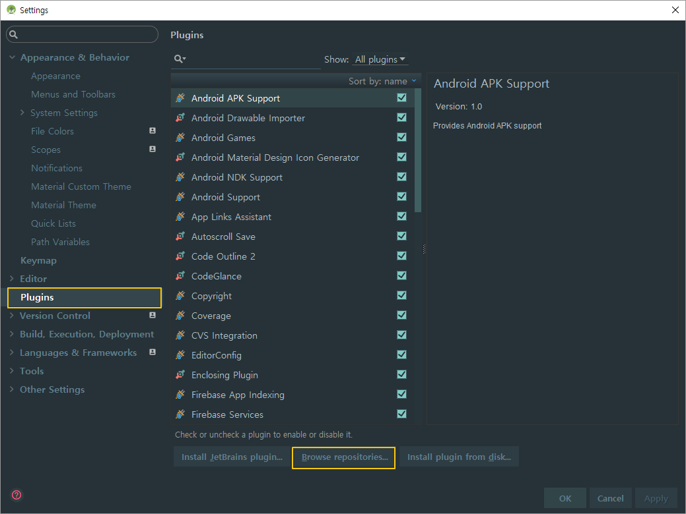
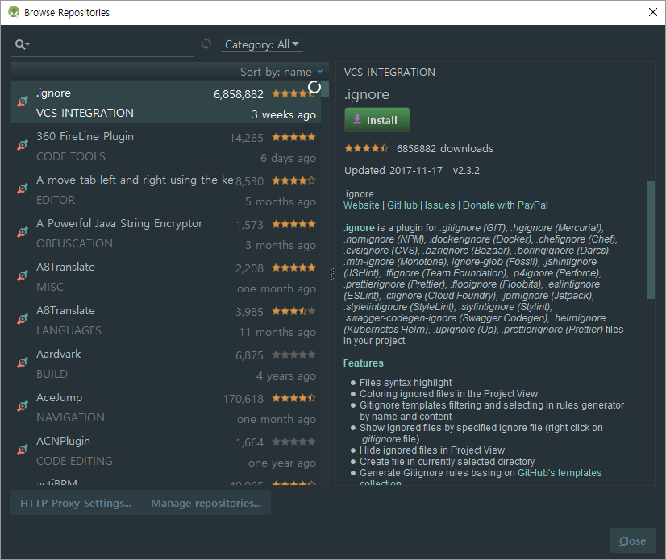
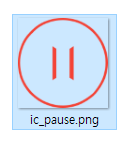
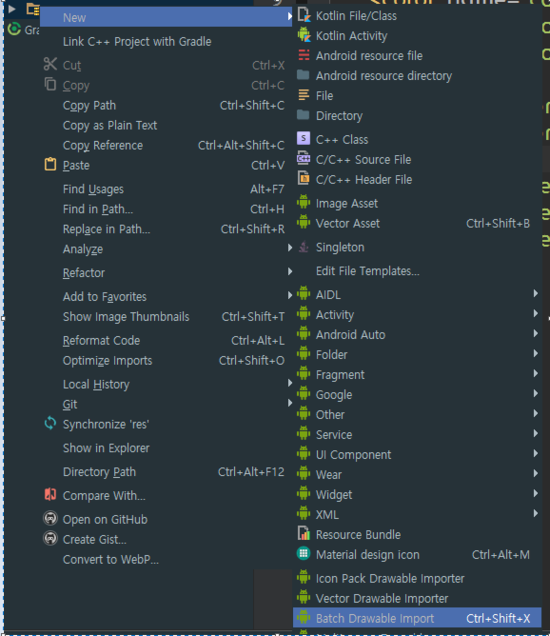
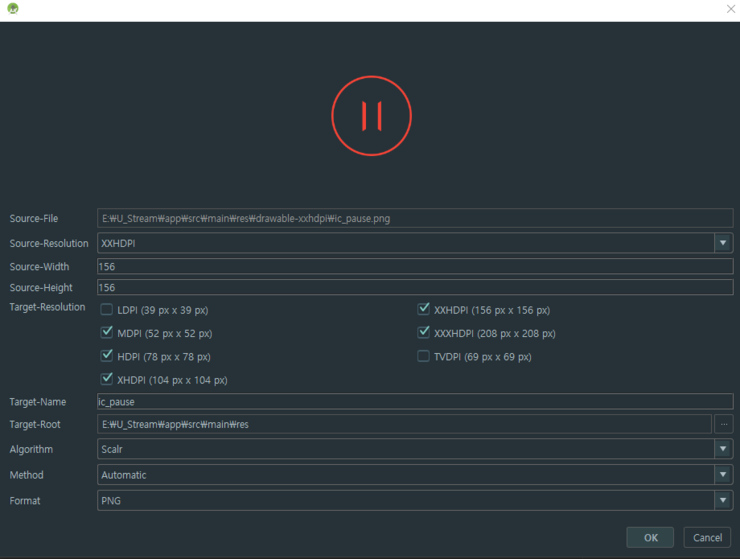
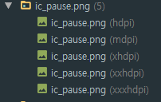
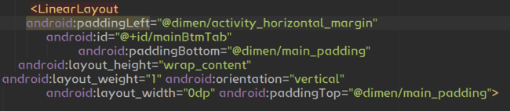
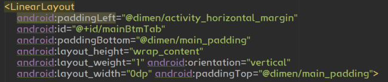
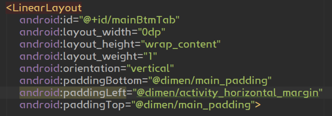

## 개인적으로 사용하는 플러그인 추천
그저 삶에 도움은 안되지만 코딩에 있어서 도움이 될 내가 쓰고 있는 플러그인 종류

- [Android Drawable Importer](#android-drawable-importer)
- [LayoutFormatter](#layoutformatter)
- CamelCase
- CodeGlance
- Android Color Manager

----

### 플러그인 설치방법
우선 플러그인을 설치하는 방법은 간단
[ Settings - Plugins - Browse repositories... ] 에서 검색을 한 뒤 설치 버튼을 누르면 된다.

----

### Android Drawable Importer
간단히 설명하면 디자이너로부터 받은 한 사이즈 기준의 이미지를 넣으면 자동으로 다양한 사이즈로 리사이징을 한 뒤 넣어주는 편리한 플러그인이다.

예시로

 
여기 디자이너가 xxhdpi (통상 1080p, 156 * 156 px) 기준의 버튼 이미지를 줬다고 치자. 
하지만 아름다운 개발을 위해 이를 
> mdpi - 52 * 52 hdpi - 78 * 78 xhdpi - 104 * 104 xxhdpi - 156 * 156 xxxhdpi - 208 * 208 

의 사이즈로 바꿔서 drawable-$$dpi 폴더에 각자 살포시 얹어 주어야 하지만 
~~디자이너에게 저거 전부 달라고 하면 뺨 맞을수도 있으므로~~ 
우리는 적응하는 개발자다.

이 플러그인(Android Drawable Importer)을 설치한 뒤 단축키를 지정해서 누르거나 리소스에서 추가를 시도하면

Batch Drawable Import 라는 친구가 생기고
이 친구를 누르면 이렇게 나오는데 여기에 아까 받은 버튼 이미지를 추가하면

#### 이렇게!

### 이렇게!
 
각 해상도에 따라 잘 정돈되어 리사이징이 완료된 이미지들이 들어가게 되고, 이 이미지를 그대로 쓰면 좀 더 디자인과 근접한 개발이 가능해진다.

----

### LayoutFormatter
여태 써본 xml파일 정리 해주는 플러그인 중에서는 최고라고 생각한다.

이건 뭐 직접 봐야 아니깐 
 
~~혼종 소환~~ 
물론 이렇게까지 정돈이 되지 않은 코드는 없을거라고 믿지만 혹시 모르니 일단 적어보았고 

이를 안드로이드 스튜디오의 기본 기능으로 정렬을 할 경우에
 
일단 한결 깔끔해지긴 하였으나 두 옵션이 한 줄에 있다거나 몇몇 아쉬운 부분이 있지만 플러그인을 사용할 경우에는
 
좀 더 말끔히 정리가 된다.  
LayoutFormatter는 그냥 줄의 띄어쓰기(탭)만을 고쳐주는게 아니라 id, width, height 등의 속성들 자체의 순서까지 정렬을 해주며
모든 레이아웃의 일관성을 맞추어주기에 사용을 습관화 하면 보기에도 편하고 저거 정리하느라 시간을 따로 쓰지 않아도 된다.
